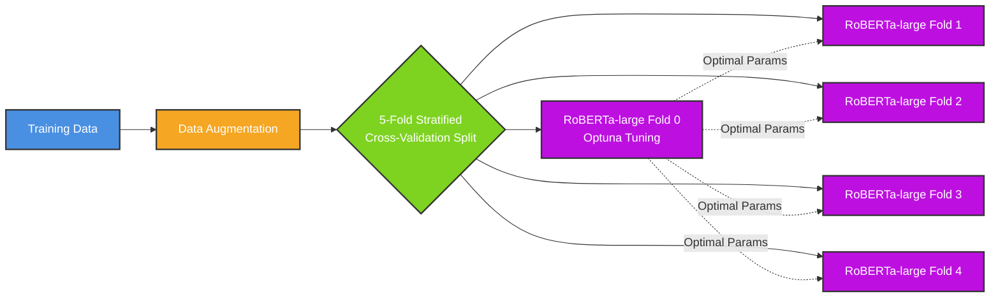
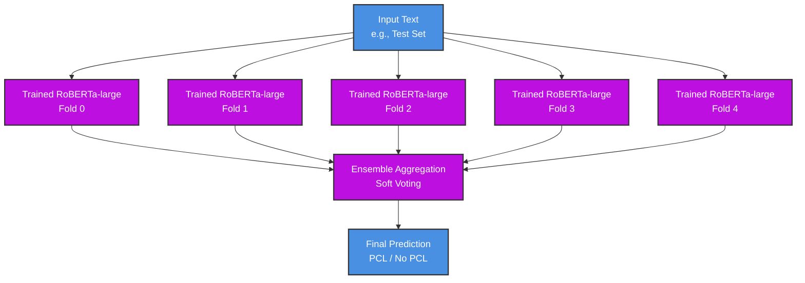

# Detecting Patronising and Condescending Language (PCL)

This repository contains my submission for the Natural Language Processing Coursework (2026), based on Task 4 (Subtask 1) from the SemEval 2022 competition.

**Name / Leaderboard Name:** Joe Reynolds

## Architecture

### Training Pipeline


### Inference Pipeline


## Repo Structure

```text
├── BestModel/                              # Contains the five model ensemble (check `generate_submission.py` for how inference works)
├── error_analysis/                         # Contains CSVs of error analysis from ablation study
├── logs/                                   # Contains logs from training and running `generate_submission.py`
├── plots/                                  # Contains plots for EDA and code used to generate them
├── scripts/                                # Contains python scripts covering augmentation, training, and evaluation
│   ├── cluster_utils.py                    # Useful functions for running on DOC cluster
│   ├── data_utils.py                       # Useful functions for data loading
│   ├── fold_dataset_gen.py                 # Generates the 5-fold stratified cross validation split augmented datasets from original unaugmented dataset
│   ├── generate_submission.py              # Runs evaluation and error analysis on the model and generates `dev.txt` and `test.txt`
│   └── train_kfold_optuna.py               # Trains the 5 folds of the model with optuna hyperparam search
├── .gitignore                              # Git ignore file
├── requirements.txt                        # Python dependencies
├── dev.txt                                 # Final model predictions on the official dev set (1 per line)
├── test.txt                                # Final model predictions on the official hidden test set (1 per line)
├── NLP_PCL_Coursework-Joe_Reynolds.pdf     # Critical review, EDA, and local evaluation write-up
└── README.md                               # This file
```

The BestModel ensemble achieved an F1 score of **0.6250** on the dev set.